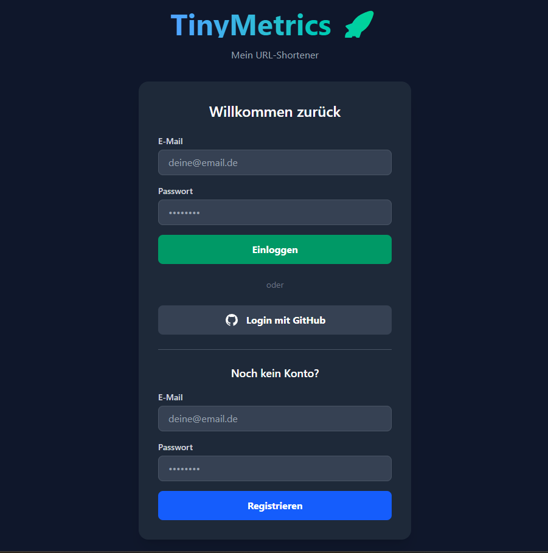
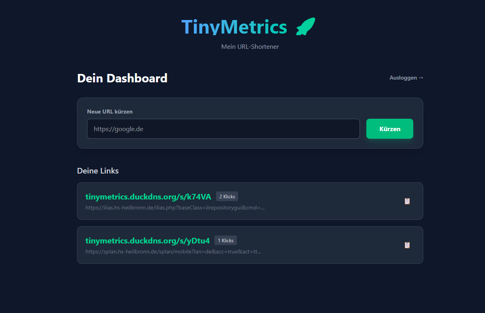

# TinyMetrics

Ein schlanker URL-Shortener mit FastAPI, Angular und PostgreSQL.

## Features

- Shortlinks über das `/s/` Präfix
- GitHub OAuth & JWT Authentifizierung
- Klick-Analytics im Backend
- Containerisiert mit Docker
- Deployment auf AWS EC2
- Kubernetes-Deployment mit K3s

## Screenshots

| Screenshot 1 | Screenshot 2 |
|--------------|--------------|
|  |  |

## Tech Stack

FastAPI, PostgreSQL, Angular, Tailwind CSS, Docker, Kubernetes/K3s, Nginx Proxy Manager, AWS EC2

## Deployment auf AWS

TinyMetrics läuft auf einer AWS EC2-Instanz. Der öffentliche Zugriff erfolgt über den Nginx Proxy Manager mit SSL-Zertifikaten von Let's Encrypt.

Routing:

- `/` → Frontend
- `/api` → Backend
- `/s` → Backend

## Kubernetes Deployment

Die Anwendung wurde von einem Docker-Compose-basierten Setup auf eine Kubernetes-Variante mit K3s migriert.

Da der Nginx Proxy Manager weiterhin die Ports `80` und `443` verwendet, wurde K3s ohne Traefik installiert:

```bash
curl -sfL https://get.k3s.io | sudo sh -s - --disable=traefik
```

Die Kubernetes-Manifeste befinden sich im Ordner `k8s/`.

Umgesetzt wurden:

- Namespace `tinymetrics`
- PostgreSQL als StatefulSet mit Persistent Volume
- Backend als Deployment mit Service
- Frontend als Deployment mit Service
- Kubernetes Secret für Datenbank- und Auth-Konfiguration
- NodePort-Zugriff für Backend und Frontend
- Health Check Endpoint `/health` für das Backend
- Readiness- und Liveness-Probes für das Backend

Aktueller Traffic-Flow:

```text
Domain
→ Nginx Proxy Manager
→ Kubernetes NodePort Services
→ Frontend/Backend Pods
→ PostgreSQL StatefulSet
```

## Kubernetes Befehle

Status prüfen:

```bash
kubectl get pods -n tinymetrics
kubectl get svc -n tinymetrics
kubectl get pvc -n tinymetrics
```

Backend testen:

```bash
curl http://localhost:30081/health
```

Frontend testen:

```bash
curl -I http://localhost:30080
```

Deployment anwenden:

```bash
kubectl apply -f k8s/namespace.yaml
kubectl apply -f k8s/postgres.yaml
kubectl apply -f k8s/backend.yaml
kubectl apply -f k8s/frontend.yaml
```

## Start mit Docker Compose

```bash
git clone https://github.com/abcakir/tinymetrics-api.git
cd tinymetrics-api
docker compose up -d --build
```

## Tests

```bash
docker compose exec app pytest
```
